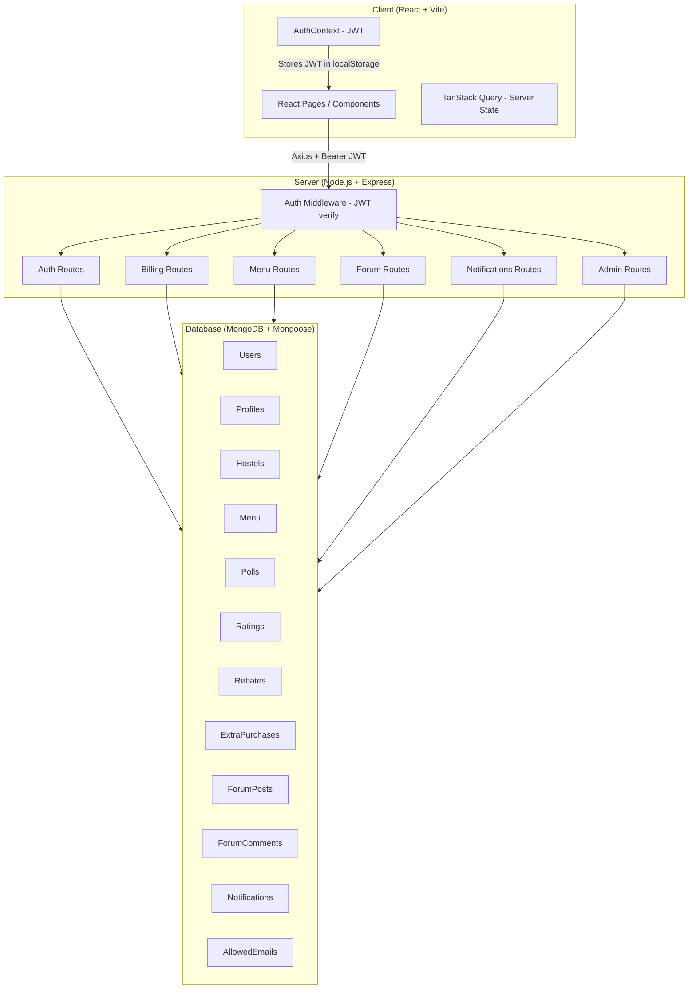

# Rasoi 🍲 — Hostel Mess Management System

> **"A comprehensive digitization platform for large-scale institutional operations."**

Rasoi is a full-stack web application that digitizes every aspect of complex institutional dining management: dynamic menus, democratic polling on food suggestions, rebate workflows, extras billing, and administrative elections — all from one seamless dashboard.

---

## 🏗️ Architecture



---

## ✨ Features

| Feature | Roles |
|---|---|
| Daily menu viewing & dish ratings | All |
| Weekly menu polls & food suggestions | Student, MHMC, Admin |
| Extras billing (ice cream, snacks, etc.) | MunimJi, Admin |
| Rebate filing & approval workflow | Student → MHMC/Admin |
| Student monthly bill summary | Student, MHMC, Admin |
| MHMC elections (nominate, campaign, vote) | MHMC, Admin |
| Community forum (posts & comments) | Student, MHMC, Admin |
| Push notifications | All |
| Admin: hostel management, user roles | Admin only |

---

## 🛠️ Tech Stack & Design Decisions

| Layer | Technology | Why |
|---|---|---|
| Frontend | React 18 + Vite | Fast HMR, optimal bundle splits |
| Styling | Tailwind CSS + Framer Motion | Utility-first + smooth animations |
| UI Components | shadcn/ui (Radix) | Accessible, headless, unstyled |
| Server state | TanStack Query | Caching, background refetch, no Redux boilerplate |
| Backend | Node.js + Express 5 | Non-blocking I/O ideal for concurrent mess-time traffic spikes |
| Database | MongoDB + Mongoose | Flexible schema suits multi-hostel config divergence; menu & forum data is document-shaped |
| Auth | JWT (bcryptjs + jsonwebtoken) | Stateless — scales horizontally without session store |
| Validation | Zod | Schema-first validation shared between route handler and tests |
| Security | helmet, express-rate-limit | Defense-in-depth headers + brute-force protection on auth routes |

**Why MongoDB over PostgreSQL?** Menu items, poll options, and forum posts are document-shaped and vary per hostel. The flexible schema reduces migration overhead during active feature development. Financial data (rebates, billing) uses strict Mongoose schema validation to compensate for the lack of DB-level constraints.

---

## ⚖️ Scale & Performance

Rasoi is designed for **300–1,500 concurrent students** per hostel deployment:

- **Auth** is stateless JWT — no session DB queries on every request.
- **TanStack Query** caches menu/poll responses client-side, reducing server round-trips during peak meal-check times.
- **express-rate-limit** prevents auth endpoint abuse (100 req/15 min per IP).
- **MongoDB Atlas** provides automatic sharding and replica sets for read-heavy workloads.
- **Horizontal scaling**: the Express server is stateless (no in-memory session). Multiple instances can run behind a load balancer (e.g., Nginx or AWS ALB) with a shared MongoDB Atlas cluster.

> For 10,000+ students (multi-campus): add Redis for notification fan-out, introduce a message queue (BullMQ) for bulk billing runs, and consider read replicas for the dashboard queries.

---

## 🔐 Role System

| Role | Access |
|---|---|
| `student` | Menu, Dashboard, Rebate, Billing, Forum |
| `mhmc` | All student + MHMC panel, poll management, rebate approval |
| `munimji` | Extras billing, student search |
| `admin` | Full access + user/hostel management |

Access is enforced at **two layers**: `protect` middleware (JWT verification) + role checks inside each route handler.

---

## 🔌 API Reference

| Method | Endpoint | Auth | Description |
|---|---|---|---|
| POST | `/api/auth/validate-email` | ❌ | Check if email is on allowed list |
| POST | `/api/auth/signup` | ❌ | Register account |
| POST | `/api/auth/login` | ❌ | Login, returns JWT |
| GET | `/api/auth/me` | ✅ | Get current user profile |
| GET | `/api/menu` | ✅ | Get current week's menu |
| GET | `/api/menu/polls` | ✅ | Get active food polls |
| POST | `/api/menu/polls/:id/vote` | ✅ | Vote on a poll |
| GET | `/api/billing/summary` | ✅ | Get net bill (base + extras − rebates) |
| POST | `/api/billing/rebates` | ✅ | File a rebate request |
| GET | `/api/billing/rebates/all` | ✅ Admin/MHMC | View all hostel rebates |
| POST | `/api/billing/extras` | ✅ MunimJi/Admin | Bill extra items to a student |
| GET | `/api/forum/posts` | ✅ | List forum posts |
| POST | `/api/forum/posts` | ✅ | Create a post |
| GET | `/api/notifications` | ✅ | Get user notifications |

---

## ⚙️ Prerequisites

- Node.js v18+
- MongoDB (local or [MongoDB Atlas](https://cloud.mongodb.com))

---

## 🚀 Local Setup

```bash
# 1. Clone the repo
git clone <repository-url>
cd Rasoi

# 2. Install dependencies (frontend + backend — shared package.json)
npm install

# 3. Configure environment
cp .env.example .env
# Fill in MONGO_URI, JWT_SECRET, JWT_EXPIRES_IN, PORT, CLIENT_URL
```

**Start backend:**
```bash
npm run server
# API available at http://localhost:3001
```

**Start frontend (new terminal):**
```bash
npm run dev
# UI available at http://localhost:8080
```

---

## ☁️ Live Application

You can access the deployed application here: **[https://rasoi-nn78.vercel.app](https://rasoi-nn78.vercel.app)**

---

## 📂 Project Structure

```
Rasoi/
├── src/                    # React frontend
│   ├── pages/              # Full-page route components
│   ├── components/         # Reusable UI components
│   │   └── ui/             # shadcn/ui base components
│   ├── contexts/           # AuthContext (JWT state)
│   ├── hooks/              # Custom React hooks
│   └── tests/              # Frontend unit tests (Vitest + RTL)
├── server/                 # Express backend
│   ├── models/             # Mongoose schemas (12 models)
│   ├── routes/             # REST endpoint handlers (7 route files)
│   ├── middleware/         # JWT auth middleware
│   └── tests/              # Server unit tests (Vitest, no DB)
├── public/                 # Static assets
└── vite.config.js          # Vite + Vitest configuration
```

---

## 📄 License

MIT
